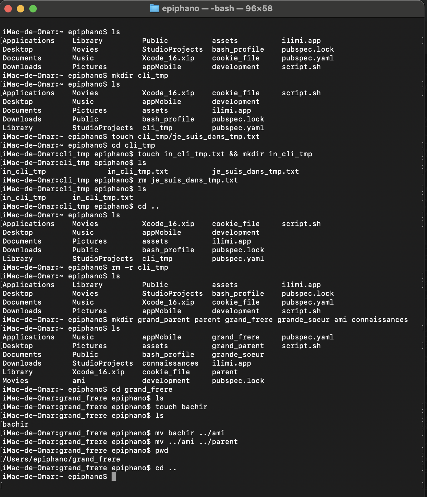

Explications:
mkdir cli_tmp : création d'un répertoire nommé cli_tmp \

touch cli_tmp/je_suis_dans_tmp.txt : création d'un fichier nommé je_suis_dans_tmp.txt dans le répertoire cli_tmp
cd cli_tmp : déplacement dans le répertoire cli_tmp
touch in_cli_tmp.txt && mkdir in_cli_tmp : création d'un fichier nommé in_cli_tmp.txt et d'un répertoire nommé in_cli_tmp dans le répertoire cli_tmp
cd .. : retour au répertoire parent
rm -r cli_tmp : suppression du répertoire cli_tmp et de son contenu
mkdir grand_parent parent grand_frere grande_soeur ami connaissances : création des répertoires grand_parent, parent, grand_frere, grande_soeur, ami et connaissances
cd grand_frere : déplacement dans le répertoire grand_frere
touch bachir : création d'un fichier nommé bachir dans le répertoire grand_frere
mv bachir ../ami : déplacement du fichier bachir dans le répertoire ami
mv ../ami ../parent : déplacement du répertoire ami dans le répertoire parent
pwd : affichage du chemin absolu du répertoire courant
cd .. : retour au répertoire parent