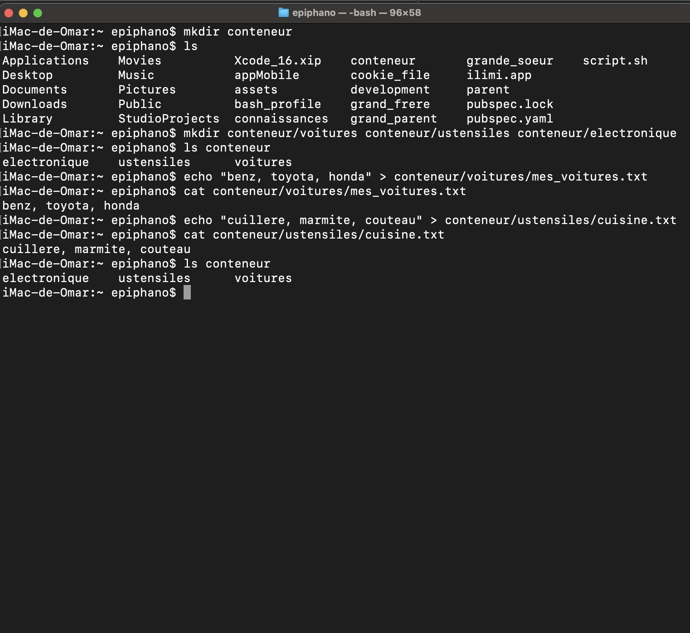

Explications:

mkdir conteneur : création d'un répertoire nommé conteneur

mkdir conteneur/voitures conteneur/ustensiles conteneur/electronique : création de trois sous-répertoires dans conteneur

echo "benz, toyota, honda" > conteneur/voitures/mes_voitures.txt : création d'un fichier nommé mes_voitures.txt dans le répertoire conteneur/voitures et ajout de la liste des voitures dans ce fichier

echo "cuillere, marmite, couteau" > conteneur/ustensiles/cuisine.txt : création d'un fichier nommé cuisine.txt dans le répertoire conteneur/ustensiles et ajout de la liste des ustensiles dans ce fichier

ls conteneur : affichage du contenu du répertoire conteneur