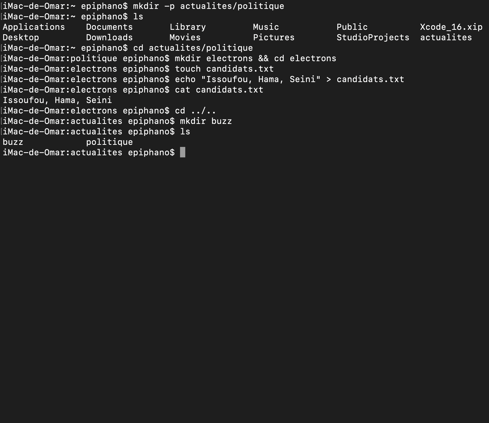

Explications:

mkdir -p actualites/politique : création d'un répertoire nommé actualites avec un sous-répertoire nommé politique (l'option -p permet de créer les répertoires parents si nécessaire)

cd actualites/politique : déplacement dans le répertoire actualites/politique

mkdir electrons && cd electrons : création d'un répertoire nommé electrons et déplacement dans ce répertoire

touch candidats.txt : création d'un fichier nommé candidats.txt dans le répertoire electrons

echo "Issoufou, Hama, Seini" > candidats.txt : ajout de la liste de la chaine "Issoufou, Hama, Seini" dans le fichier candidats.txt

cat candidats.txt : affichage du contenu du fichier candidats.txt

cd ../.. : retour au répertoire grand-parent (deux niveaux au-dessus)

mkdir buzz : création d'un répertoire nommé buzz dans le répertoire actualites

ls : affichage du contenu du répertoire courant, qui contient les sous-répertoires politique et buzz