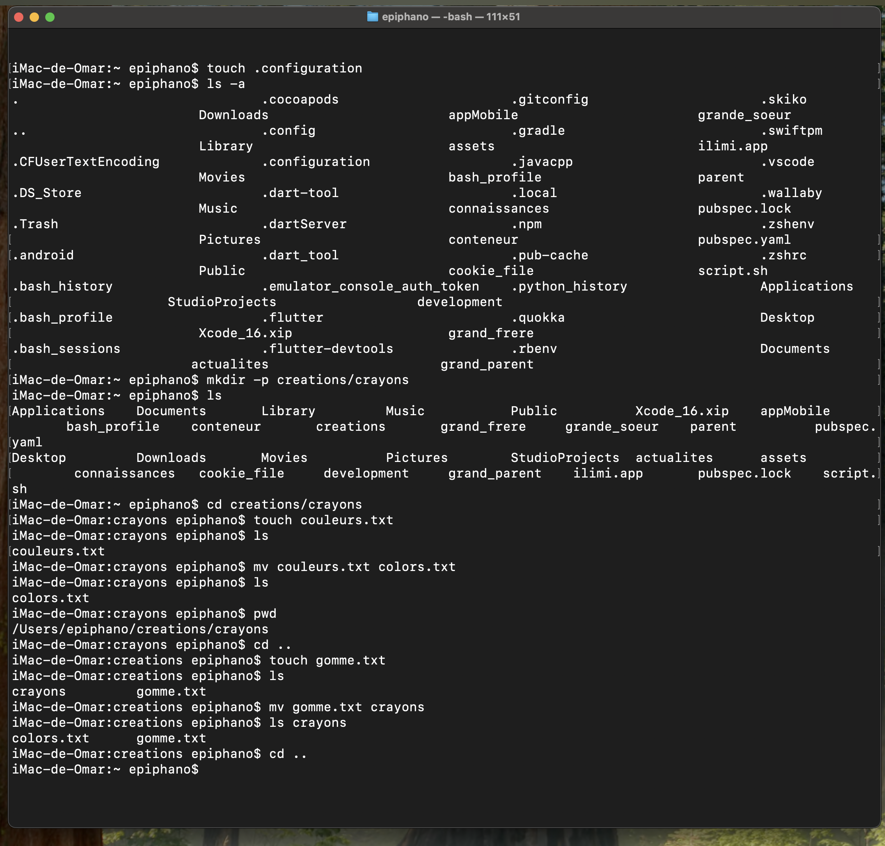

Explications:

touch .configuration : création d'un fichier nommé .configuration dans le répertoire courant (ce fichier est caché car son nom commence par un point)

ls -a : affichage de tous les fichiers, y compris les fichiers cachés (option -a)

mkdir -p creations/crayons : création d'un répertoire nommé creations avec un sous-répertoire nommé crayons (l'option -p permet de créer les répertoires parents si nécessaire)

cd creations/crayons : déplacement dans le répertoire creations/crayons

touch couleurs.txt : création d'un fichier nommé couleurs.txt dans le répertoire creations/crayons

mv couleurs.txt colors.txt : renommage du fichier couleurs.txt en colors.txt

pwd : affichage du chemin absolu du répertoire courant

cd .. : retour au répertoire grand-parent (un niveau au-dessus)

touch gomme.txt : création d'un fichier nommé gomme.txt dans le répertoire creations

mv gomme.txt crayons : déplacement du fichier gomme.txt dans le répertoire crayons

cd .. : retour au répertoire parent