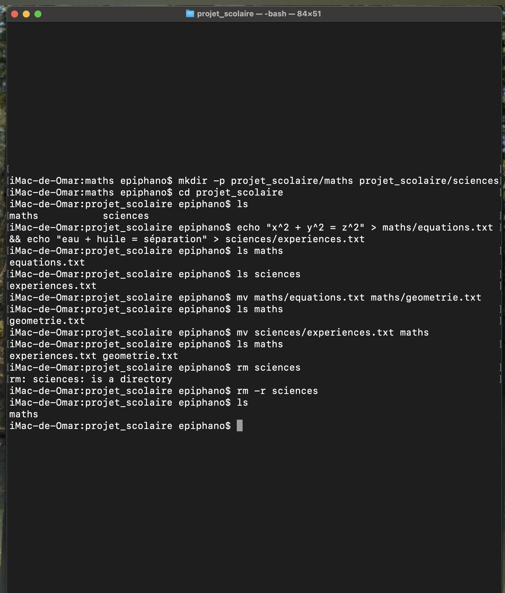

Explications:

mkdir -p projet_scolaire/maths projet_scolaire/sciences : création d'un répertoire nommé projet_scolaire avec deux sous-répertoires nommés maths et sciences (l'option -p permet de créer les répertoires parents si nécessaire)

cd projet_scolaire : déplacement dans le répertoire projet_scolaire

echo "x^2 + y^2 = z^2" > maths/equations.txt && echo "eau + huile = separation" > sciences/experiences.txt : création d'un fichier nommé equations.txt dans le répertoire maths avec le contenu "x^2 + y^2 = z^2" et création d'un fichier nommé experiences.txt dans le répertoire sciences avec le contenu "eau + huile = separation"

mv maths/equations.txt maths/geometrie.txt : renommage du fichier equations.txt en geometrie.txt dans le répertoire maths

mv sciences/experiences.txt maths :  deplacement du fichier experiences.txt dans le répertoire maths

rm -r sciences : suppression du répertoire sciences

