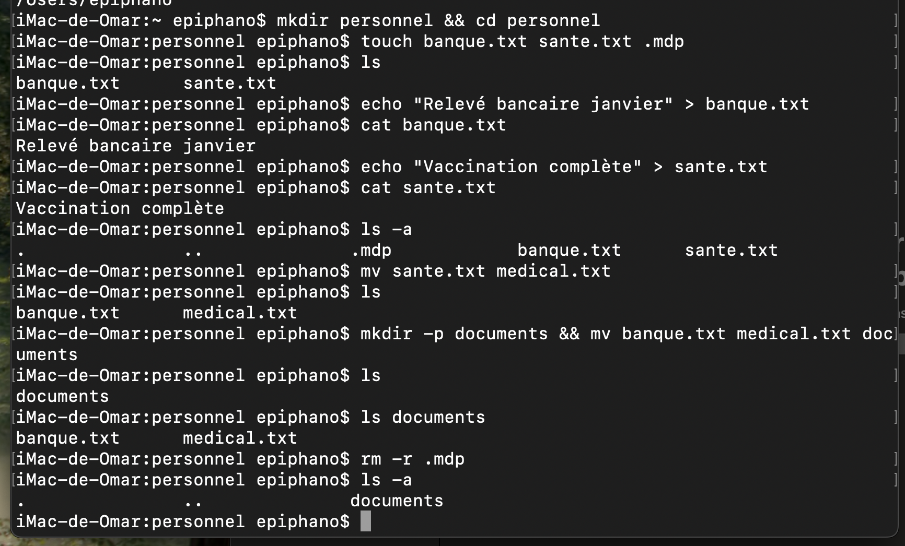

Explications:

mkdir personnel && cd personnel : création d'un répertoire nommé personnel et déplacement dans ce répertoire

touch banque.txt sante.txt .mdp : création de deux fichiers nommés banque.txt et sante.txt, ainsi qu'un fichier caché nommé .mdp dans le répertoire personnel

echo "Relevé bancaire janvier" > banque.txt : ajout de la chaine "Relevé bancaire janvier" dans le fichier banque.txt

cat banque.txt : affichage du contenu du fichier banque.txt

ls -a : affichage de tous les fichiers dans le répertoire personnel, y compris les fichiers cachés (option -a)

mv sante.txt medical.txt : renommage du fichier sante.txt en medical.txt

mkdir -p documents && mv banque.txt medical.txt documents : création d'un répertoire nommé documents et déplacement des fichiers banque.txt et medical.txt dans ce répertoire

rm -r .mdp : suppression du fichier caché .mdp